# Portugal Hotels Booking Demand

# Summary

This jupyter notebook has one dataset that has two different hotels from Portugal. This data will be analyzed to find any trends or patterns with guests booking into either hotel to try and find a way to minimize the amount of canceled bookings. A machine learning model will also be developed to attempt at predicting if a guest will cancel there booking before checking in.

There is a resort hotel in this dataset, found in the Algarve region of Portugal (southern Portugal), and a city hotel found in the captial Lisbon. Data was acquired directly from hotel's Property Managment System (PMS) SQL according to the paper which the data is originally from. The article is called, "Hotel Booking Demand Datasets", written by Nuno Antonio, Ana Almeida, and Luis Nunes for Data in Brief, Volume 22, February 2019. Found at https://www.sciencedirect.com/science/article/pii/S2352340918315191#bib5.

Dataset can also be found on Kaggle at https://www.kaggle.com/jessemostipak/hotel-booking-demand

## Import Python Librarys and Modules


```python
import numpy as np
import pandas as pd
import matplotlib.pyplot as plt
import seaborn as sns
from sklearn.model_selection import train_test_split
from sklearn.ensemble import RandomForestClassifier
from sklearn.model_selection import GridSearchCV
from sklearn.linear_model import LogisticRegression

from matplotlib import rcParams
rcParams['figure.figsize'] = 10,8
sns.set_theme()
```

## Reading and cleaning data


```python
df = pd.read_csv('hotel_bookings.csv')
```


```python
df.head()
```


<div>
<table border="1" class="dataframe">
  <thead>
    <tr style="text-align: right;">
      <th></th>
      <th>hotel</th>
      <th>is_canceled</th>
      <th>lead_time</th>
      <th>arrival_date_year</th>
      <th>arrival_date_month</th>
      <th>arrival_date_week_number</th>
      <th>arrival_date_day_of_month</th>
      <th>stays_in_weekend_nights</th>
      <th>stays_in_week_nights</th>
      <th>adults</th>
      <th>...</th>
      <th>deposit_type</th>
      <th>agent</th>
      <th>company</th>
      <th>days_in_waiting_list</th>
      <th>customer_type</th>
      <th>adr</th>
      <th>required_car_parking_spaces</th>
      <th>total_of_special_requests</th>
      <th>reservation_status</th>
      <th>reservation_status_date</th>
    </tr>
  </thead>
  <tbody>
    <tr>
      <th>0</th>
      <td>Resort Hotel</td>
      <td>0</td>
      <td>342</td>
      <td>2015</td>
      <td>July</td>
      <td>27</td>
      <td>1</td>
      <td>0</td>
      <td>0</td>
      <td>2</td>
      <td>...</td>
      <td>No Deposit</td>
      <td>NaN</td>
      <td>NaN</td>
      <td>0</td>
      <td>Transient</td>
      <td>0.0</td>
      <td>0</td>
      <td>0</td>
      <td>Check-Out</td>
      <td>2015-07-01</td>
    </tr>
    <tr>
      <th>1</th>
      <td>Resort Hotel</td>
      <td>0</td>
      <td>737</td>
      <td>2015</td>
      <td>July</td>
      <td>27</td>
      <td>1</td>
      <td>0</td>
      <td>0</td>
      <td>2</td>
      <td>...</td>
      <td>No Deposit</td>
      <td>NaN</td>
      <td>NaN</td>
      <td>0</td>
      <td>Transient</td>
      <td>0.0</td>
      <td>0</td>
      <td>0</td>
      <td>Check-Out</td>
      <td>2015-07-01</td>
    </tr>
    <tr>
      <th>2</th>
      <td>Resort Hotel</td>
      <td>0</td>
      <td>7</td>
      <td>2015</td>
      <td>July</td>
      <td>27</td>
      <td>1</td>
      <td>0</td>
      <td>1</td>
      <td>1</td>
      <td>...</td>
      <td>No Deposit</td>
      <td>NaN</td>
      <td>NaN</td>
      <td>0</td>
      <td>Transient</td>
      <td>75.0</td>
      <td>0</td>
      <td>0</td>
      <td>Check-Out</td>
      <td>2015-07-02</td>
    </tr>
    <tr>
      <th>3</th>
      <td>Resort Hotel</td>
      <td>0</td>
      <td>13</td>
      <td>2015</td>
      <td>July</td>
      <td>27</td>
      <td>1</td>
      <td>0</td>
      <td>1</td>
      <td>1</td>
      <td>...</td>
      <td>No Deposit</td>
      <td>304.0</td>
      <td>NaN</td>
      <td>0</td>
      <td>Transient</td>
      <td>75.0</td>
      <td>0</td>
      <td>0</td>
      <td>Check-Out</td>
      <td>2015-07-02</td>
    </tr>
    <tr>
      <th>4</th>
      <td>Resort Hotel</td>
      <td>0</td>
      <td>14</td>
      <td>2015</td>
      <td>July</td>
      <td>27</td>
      <td>1</td>
      <td>0</td>
      <td>2</td>
      <td>2</td>
      <td>...</td>
      <td>No Deposit</td>
      <td>240.0</td>
      <td>NaN</td>
      <td>0</td>
      <td>Transient</td>
      <td>98.0</td>
      <td>0</td>
      <td>1</td>
      <td>Check-Out</td>
      <td>2015-07-03</td>
    </tr>
  </tbody>
</table>
<p>5 rows × 32 columns</p>
</div>


```python
df.info()
```

    <class 'pandas.core.frame.DataFrame'>
    RangeIndex: 119390 entries, 0 to 119389
    Data columns (total 32 columns):
     #   Column                          Non-Null Count   Dtype  
    ---  ------                          --------------   -----  
     0   hotel                           119390 non-null  object 
     1   is_canceled                     119390 non-null  int64  
     2   lead_time                       119390 non-null  int64  
     3   arrival_date_year               119390 non-null  int64  
     4   arrival_date_month              119390 non-null  object 
     5   arrival_date_week_number        119390 non-null  int64  
     6   arrival_date_day_of_month       119390 non-null  int64  
     7   stays_in_weekend_nights         119390 non-null  int64  
     8   stays_in_week_nights            119390 non-null  int64  
     9   adults                          119390 non-null  int64  
     10  children                        119386 non-null  float64
     11  babies                          119390 non-null  int64  
     12  meal                            119390 non-null  object 
     13  country                         118902 non-null  object 
     14  market_segment                  119390 non-null  object 
     15  distribution_channel            119390 non-null  object 
     16  is_repeated_guest               119390 non-null  int64  
     17  previous_cancellations          119390 non-null  int64  
     18  previous_bookings_not_canceled  119390 non-null  int64  
     19  reserved_room_type              119390 non-null  object 
     20  assigned_room_type              119390 non-null  object 
     21  booking_changes                 119390 non-null  int64  
     22  deposit_type                    119390 non-null  object 
     23  agent                           103050 non-null  float64
     24  company                         6797 non-null    float64
     25  days_in_waiting_list            119390 non-null  int64  
     26  customer_type                   119390 non-null  object 
     27  adr                             119390 non-null  float64
     28  required_car_parking_spaces     119390 non-null  int64  
     29  total_of_special_requests       119390 non-null  int64  
     30  reservation_status              119390 non-null  object 
     31  reservation_status_date         119390 non-null  object 
    dtypes: float64(4), int64(16), object(12)
    memory usage: 29.1+ MB


We can see above there are many columns with missing values, and this will be addressed below

---


```python
df['country'].isna().value_counts()
```


    False    118902
    True        488
    Name: country, dtype: int64


Dropping the agent column entirely since it only has a integer value for the listing agent and no information about the company the agent works for or the country of origin for the agency.

There were 4 four rows with NaN value in the column 'children' and it has been assumed that these rooms did not have any children and a value of zero has been put there it its place. Its dtype was then converted to 'int64'.

Any rows that did not have a country of origin has been dropped as this seems to be questionable data (though these guests could likely be from Portugal and simpy did not enter their country of origin). There were only 488 rows dropped.

One row has a value for 'adr' greater than 4000. This means the average daily rate as defined by dividing the sum of all lodging transactions by the total number of staying nights was greater than €4,000. This is only on one row  and has been dropped since it is an extreme outlier.

Some rooms did not have any adults or children registered for that booking, and is likely some data had been incomplete when being filled in, same with rows that did not have a country of origin.

Lastly, all null values for 'company' column has been filled in with integer value zero.


```python
df.drop('agent', axis=1, inplace=True)
df.loc[(df[df['children'].isna()].index.values),'children'] = 0
df.children = df.children.astype('int64')
df.drop(df[df['country'].isna()].index.values,axis=0, inplace=True)

df.drop(df[df['adr'] > 4000].index.values,axis=0, inplace=True) # add to note above
df.drop(df[df['adults']==0].index.values,axis=0, inplace=True)
df['company'].fillna(value=0,inplace=True)
```

# EDA & Visualizing hotel data

We will begin by talking about each column in more depth:

* **hotel**- Either resort hotel, Algarve, or City hotel, Lisbon.  
* **is_canceled**- If a guest has cancelled a booking or not before checking into a hotel, value of 1 or 0 respectively.  
* **lead_time**- The day a guest made their booking, ie number of days before guest is expected to arrive.  
* **arrive_date_year**- The year the guest is expected to arrive at a hotel, from 2016-2017.  
* **arrival_date_month**- The month of the year the guest is expected to arrive at a hotel.  
* **arrival_date_week_number**- The week number (52 weeks in a year) the guest is expected to arrive at a hotel. 
* **arrival_date_day_of_month**- The day of the month the guest is expected to arrive at a hotel.  
* **stays_in_weekend_nights**- The number of nights the guest is going to stay during the weekend.  
* **stays_in_week_nights**- The number of nigths the guest is going to stay during the week.  
* **adults**- Number of adults booked to stay in the room for the duration of their time in the hotel.  
* **children**- Number of children booked to stay in the room for the duration of their time in the hotel.  
* **babies**- Number of babies booked to stay in a room for the duration of their time in the hotel.  
* **meal**- Type of meal booked. Categories are presented in standard hospitality meal packages: 
    * Undefined/SC – no meal package  
    * BB – Bed & Breakfast  
    * HB – Half board (breakfast and one other meal – usually dinner)  
    * FB – Full board (breakfast, lunch and dinner)  
* **country**- Country of origin. Categories are represented in the ISO 3155–3:2013 format.  
* **market_segment**- Market segment designation. In categories, the term “TA” means “Travel Agents” and “TO” means “Tour Operators”.  
* **distribution_channel**-Booking distribution channel. The term “TA” means “Travel Agents” and “TO” means “Tour Operators”.  
* **is_repeated_guest**- Value indicating if the booking name was from a repeated guest (1) or not (0).  
* **previous_cancellations**- Number of previous bookings that were cancelled by the customer prior to the current booking.  
* **previous_bookings_not_canceled**- Number of previous bookings not cancelled by the customer prior to the current booking.  
* **reserved_room_type**- Code of room type reserved. Code is presented instead of designation for anonymity reasons.  
* **assigned_room_type**- Code for the type of room assigned to the booking. Sometimes the assigned room type differs from the reserved room type due to hotel operation reasons (e.g. overbooking) or by customer request. Code is presented instead of designation for anonymity reasons.  
* **booking_changes**- Number of changes/amendments made to the booking from the moment the booking was entered on the PMS until the moment of check-in or cancellation.  
* **deposit_type**- Indication on if the customer made a deposit to guarantee the booking. This variable can assume three categories:  
    * No Deposit – no deposit was made  
    * Non Refund – a deposit was made in the value of the total stay cost  
    * Refundable – a deposit was made with a value under the total cost of stay. 
* **agent**- ID of the travel agency that made the booking.  
* **company**- ID of the company/entity that made the booking or responsible for paying the booking. ID is presented instead of designation for anonymity reasons.  
* **days_in_waiting_list**- Number of days the booking was in the waiting list before it was confirmed to the customer.  
* **customer_type**- Type of booking, assuming one of four categories:
    * Contract - when the booking has an allotment or other type of contract associated to it
    * Group – when the booking is associated to a group
    * Transient – when the booking is not part of a group or contract, and is not associated to other transient booking  
    * Transient-party – when the booking is transient, but is associated to at least other transient booking  
* **adr**- Average Daily Rate as defined by dividing the sum of all lodging transactions by the total number of staying nights.  
* **required_car_parking_spaces**- Number of car parking spaces required by the customer.
* **total_of_special_requests**- Number of special requests made by the customer (e.g. twin bed or high floor).  
* **reservation_status**- Reservation last status, assuming one of three categories:  
    * Canceled – booking was canceled by the customer
    * Check-Out – customer has checked in but already departed
    * No-Show – customer did not check-in and did inform the hotel of the reason why  
* **reservation_status_date**- Date at which the last status was set. This variable can be used in conjunction with the ReservationStatus to understand when was the booking canceled or when did the customer checked-out of the hotel

## Resort & City Hotel

Below we see in figure 1 that there are many more city hotel bookings then there are resort hotel bookings in this dataset.


```python
sns.countplot(x='hotel', data=df, palette='Set2');
plt.title('Number of bookings for Resort and City hotel')
txt_1='Fig.1 - Resort hotel is in Algarve region of Portugal and the city hotel is in Lisbon, the capital of Portugal'
plt.figtext(0.5, -0.1, txt_1, wrap=True, horizontalalignment='center', fontsize=12);
```


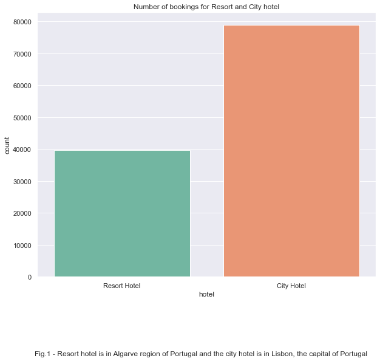


```python
round(df['is_canceled'].value_counts()[1]/df['is_canceled'].value_counts()[0],4)*100
```


    58.84


```python
sns.countplot(x='is_canceled', data=df);
plt.title('Number of bookings canceled for both hotels')
txt_2='Fig.2 - About 58.85% of bookings were canceled, from both hotels, before the guests checked in.'
plt.figtext(0.5, -0.1, txt_2, wrap=True, horizontalalignment='center', fontsize=12);
```


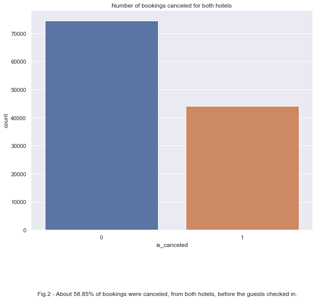


```python
round(df[df['hotel'] == 'City Hotel']['is_canceled'].value_counts()[1]/df[df['hotel'] == 'City Hotel']['is_canceled'].value_counts()[0],4)*100
```


    71.61


```python
sns.countplot(x='is_canceled', data=df[df['hotel'] == 'City Hotel'], palette='rocket');
plt.title('Number of bookings canceled for Lisbon Hotel')
txt_3='Fig.3 - About 71.61% of bookings were canceled for Lisbon hotel before the guests checked in.'
plt.figtext(0.5, -0.1, txt_3, wrap=True, horizontalalignment='center', fontsize=12);
```


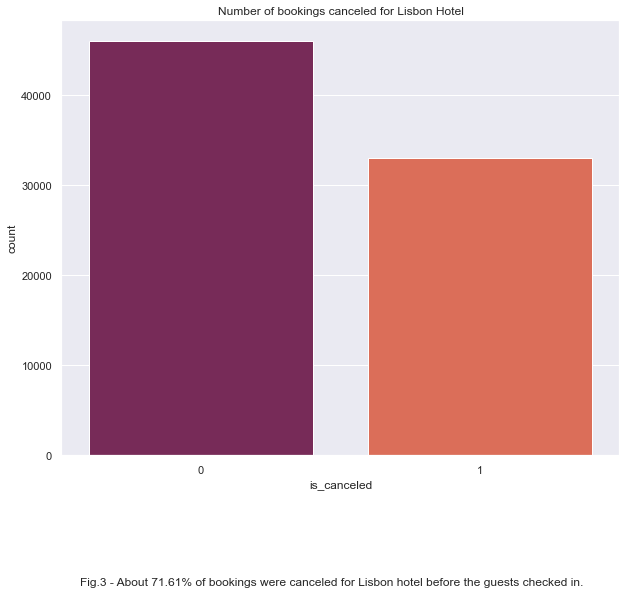


```python
round(df[df['hotel'] == 'Resort Hotel']['is_canceled'].value_counts()[1]/df[df['hotel'] == 'Resort Hotel']['is_canceled'].value_counts()[0],4)*100
```


    38.43


```python
sns.countplot(x='is_canceled', data=df[df['hotel'] == 'Resort Hotel'], palette='mako');
plt.title('Number of bookings canceled for Algarve Hotel')
txt_4='Fig.4 - About 38.43% of bookings were canceled for Algarve hotel before the guests checked in.'
plt.figtext(0.5, -0.1, txt_4, wrap=True, horizontalalignment='center', fontsize=12);
```


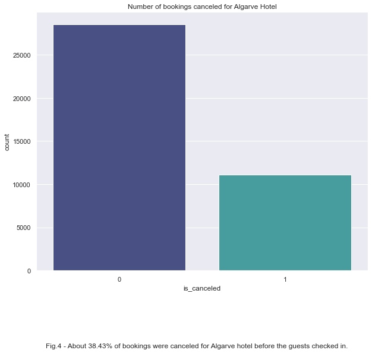


Most of the bookings for this dataset are from the city hotel (Lisbon) which also has a higher chance of a guest canceling before they check in at 71.61%, where as the resort hotel (Algarve) only has around 38.43% chance of a guest canceling there booking. This suggests most people are looking around at multiple hotels to stay at in a city, but slightly more committed to pulling trigger for a resort hotel. That being said we would need more hotels from cities and then more resort hotels to confirm this theory.

### Countries Analysis

Now we will investigate what country has the most guests booking rooms, and if some countries guests are more likely to cancel.


```python
df['country'].value_counts().head(10).plot.bar();
plt.title('Number of Bookings from Top 10 Countries for Both Hotels')
txt_5='Fig.5 - Most of the bookings are clearly from Portugal'
plt.figtext(0.5, -0.01, txt_5, wrap=True, horizontalalignment='center', fontsize=12);
```


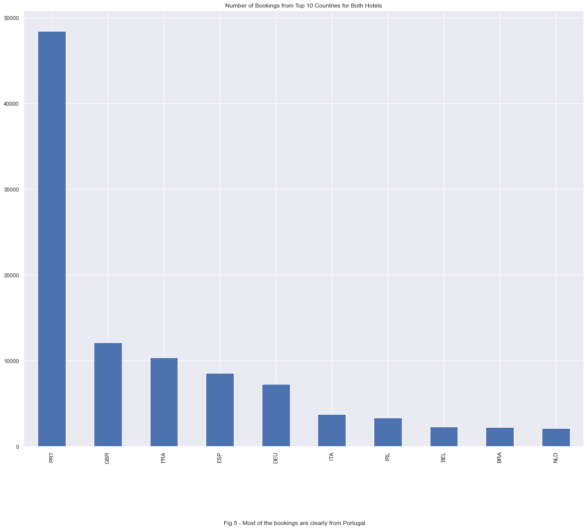


We can see in Figure 5 that most guests are coming from this host country, Portugal, at 56.76%. Only one country is on the list that is not in Europe and that is Brazil.


```python
tmp = df.groupby('country')['is_canceled'].sum()/df.groupby('country')['is_canceled'].count()
tmp.sort_values(ascending=False).loc[df['country'].value_counts().head(10).index.values]
```


    country
    PRT    0.567580
    GBR    0.202313
    FRA    0.185813
    ESP    0.254271
    DEU    0.167102
    ITA    0.353945
    IRL    0.246291
    BEL    0.202494
    BRA    0.372514
    NLD    0.182426
    Name: is_canceled, dtype: float64


```python
df[df['hotel'] == 'City Hotel']['country'].value_counts().head(10).plot.bar();
plt.title('Number of Bookings from Top 10 Countries - Lisbon')
txt_6='Fig.6 - City hotel bookings from top 10 countries.'
plt.figtext(0.5, -0.01, txt_6, wrap=True, horizontalalignment='center', fontsize=12);
```


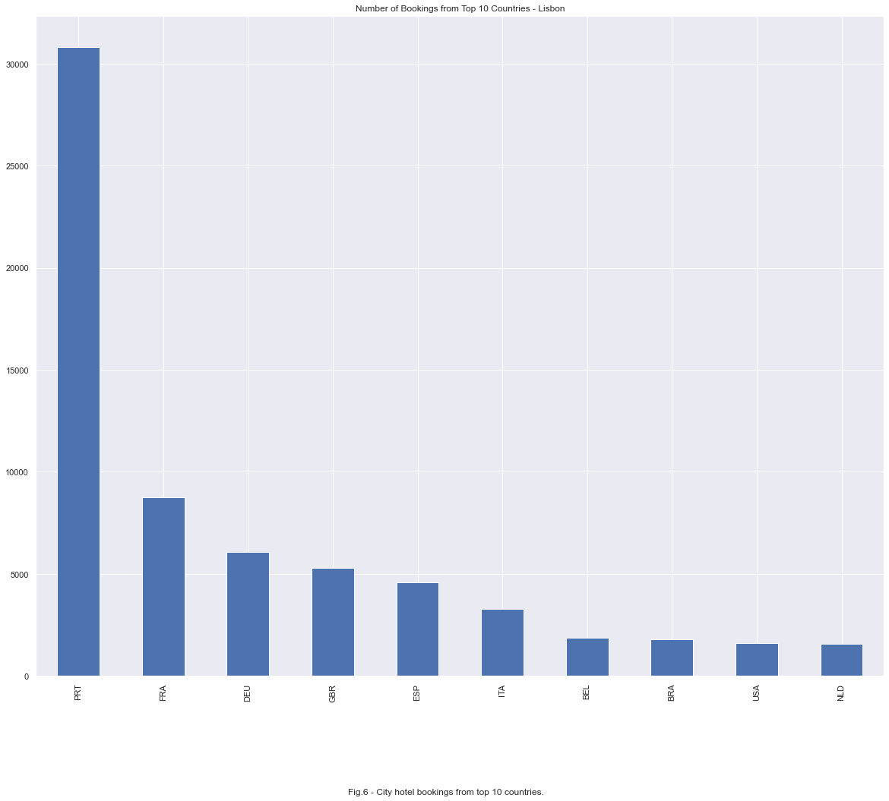


We can see in Figure 6 that most guests are also from Portugal when staying in Lisbon.


```python
tmp = df[df['hotel'] == 'City Hotel'].copy()
tmp_ = tmp.groupby('country')['is_canceled'].sum()/tmp.groupby('country')['is_canceled'].count()
tmp_.sort_values(ascending=False).loc[tmp['country'].value_counts().head(10).index.values]
```


    country
    PRT    0.650777
    FRA    0.195870
    DEU    0.176170
    GBR    0.294407
    ESP    0.288017
    ITA    0.378986
    BEL    0.219382
    BRA    0.405724
    USA    0.264633
    NLD    0.206329
    Name: is_canceled, dtype: float64


```python
df[df['hotel'] == 'Resort Hotel']['country'].value_counts().head(10).plot.bar();
plt.title('Number of Bookings from Top 10 Countries - Algarve')
txt_7='Fig.7 - Resort hotel bookings from top 10 countries staying.'
plt.figtext(0.5, -0.01, txt_7, wrap=True, horizontalalignment='center', fontsize=12);
```


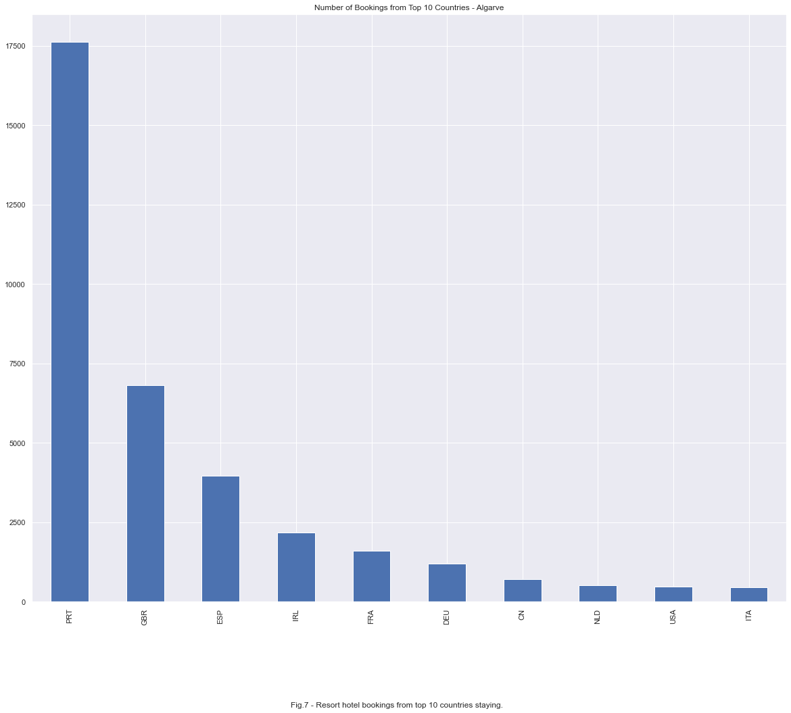


We can see in Figure 6 that most guests are also from Portugal when staying in Lisbon.


```python
tmp = df[df['hotel'] == 'Resort Hotel'].copy()
tmp_ = tmp.groupby('country')['is_canceled'].sum()/tmp.groupby('country')['is_canceled'].count()
tmp_.sort_values(ascending=False).loc[tmp['country'].value_counts().head(10).index.values]
```


    country
    PRT    0.422086
    GBR    0.130779
    ESP    0.215116
    IRL    0.199446
    FRA    0.131056
    DEU    0.121363
    CN     0.135211
    NLD    0.108949
    USA    0.150313
    ITA    0.174292
    Name: is_canceled, dtype: float64


```python
sns.set(rc={'figure.figsize':(20,16)})
df_tmp = df[df['arrival_date_year'] == 2015]
sns.barplot(x='arrival_date_month',y='lead_time',hue='is_canceled',data=df_tmp);
plt.title('Lead time for All Bookings for Each Month for the Year 2015')
txt_8='Fig.8 - Number of days guests booked in advance for each month in the year 2015. Each month has data for number of guests who cancelled and how many checked in.'
plt.figtext(0.5, 0.05, txt_8, wrap=True, horizontalalignment='center', fontsize=12);
```


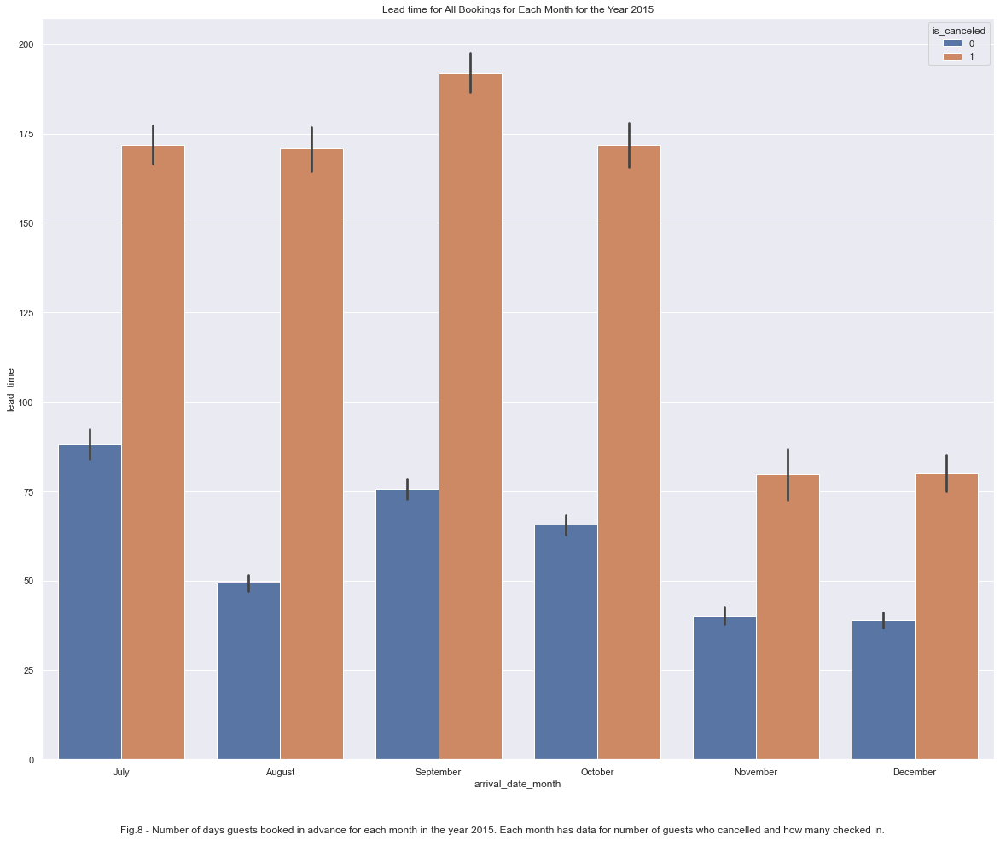


```python
df_tmp.groupby('arrival_date_month')[['is_canceled','lead_time']].mean().sort_values(by='is_canceled', ascending=False)
```


<div>
<style scoped>
    .dataframe tbody tr th:only-of-type {
        vertical-align: middle;
    }

    .dataframe tbody tr th {
        vertical-align: top;
    }

    .dataframe thead th {
        text-align: right;
    }
</style>
<table border="1" class="dataframe">
  <thead>
    <tr style="text-align: right;">
      <th></th>
      <th>is_canceled</th>
      <th>lead_time</th>
    </tr>
    <tr>
      <th>arrival_date_month</th>
      <th></th>
      <th></th>
    </tr>
  </thead>
  <tbody>
    <tr>
      <th>July</th>
      <td>0.455664</td>
      <td>126.365545</td>
    </tr>
    <tr>
      <th>August</th>
      <td>0.412174</td>
      <td>99.364457</td>
    </tr>
    <tr>
      <th>September</th>
      <td>0.408733</td>
      <td>123.068253</td>
    </tr>
    <tr>
      <th>October</th>
      <td>0.348851</td>
      <td>102.595650</td>
    </tr>
    <tr>
      <th>December</th>
      <td>0.335517</td>
      <td>52.683793</td>
    </tr>
    <tr>
      <th>November</th>
      <td>0.209483</td>
      <td>48.476724</td>
    </tr>
  </tbody>
</table>
</div>


```python
df_tmp = df[df['arrival_date_year'] == 2016]
sns.barplot(x='arrival_date_month',y='lead_time',hue='is_canceled',data=df_tmp);
plt.title('Lead time for All Bookings for Each Month for the Year 2016')
txt_9='Fig.9 - Number of days guests booked in advance for each month in the year 2016. Each month has data for number of guests who cancelled and how many checked in.'
plt.figtext(0.5, 0.05, txt_9, wrap=True, horizontalalignment='center', fontsize=12);
```


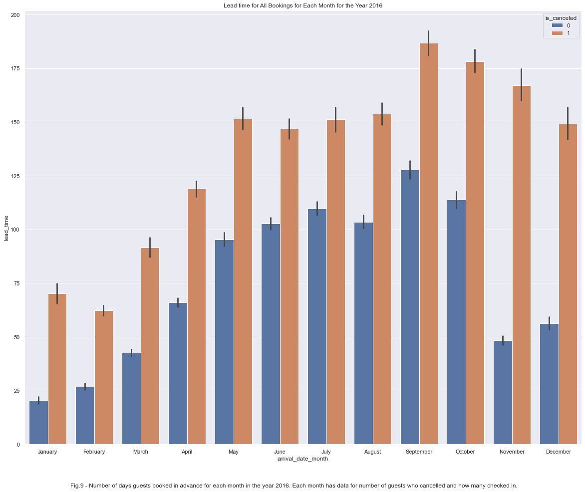


```python
df_tmp.groupby('arrival_date_month')[['is_canceled','lead_time']].mean().sort_values(by='is_canceled', ascending=False)
```


<div>
<style scoped>
    .dataframe tbody tr th:only-of-type {
        vertical-align: middle;
    }

    .dataframe tbody tr th {
        vertical-align: top;
    }

    .dataframe thead th {
        text-align: right;
    }
</style>
<table border="1" class="dataframe">
  <thead>
    <tr style="text-align: right;">
      <th></th>
      <th>is_canceled</th>
      <th>lead_time</th>
    </tr>
    <tr>
      <th>arrival_date_month</th>
      <th></th>
      <th></th>
    </tr>
  </thead>
  <tbody>
    <tr>
      <th>October</th>
      <td>0.406736</td>
      <td>140.018620</td>
    </tr>
    <tr>
      <th>June</th>
      <td>0.396780</td>
      <td>120.053409</td>
    </tr>
    <tr>
      <th>April</th>
      <td>0.381014</td>
      <td>86.188379</td>
    </tr>
    <tr>
      <th>September</th>
      <td>0.375627</td>
      <td>149.689578</td>
    </tr>
    <tr>
      <th>November</th>
      <td>0.368682</td>
      <td>91.964350</td>
    </tr>
    <tr>
      <th>December</th>
      <td>0.363114</td>
      <td>90.105016</td>
    </tr>
    <tr>
      <th>August</th>
      <td>0.360902</td>
      <td>121.638306</td>
    </tr>
    <tr>
      <th>May</th>
      <td>0.350348</td>
      <td>114.914197</td>
    </tr>
    <tr>
      <th>February</th>
      <td>0.346383</td>
      <td>39.144672</td>
    </tr>
    <tr>
      <th>July</th>
      <td>0.327988</td>
      <td>123.523506</td>
    </tr>
    <tr>
      <th>March</th>
      <td>0.308271</td>
      <td>57.713659</td>
    </tr>
    <tr>
      <th>January</th>
      <td>0.251467</td>
      <td>32.959819</td>
    </tr>
  </tbody>
</table>
</div>


```python
df_tmp = df[df['arrival_date_year'] == 2017]
sns.barplot(x='arrival_date_month',y='lead_time',hue='is_canceled',data=df_tmp);
plt.title('Lead time for All Bookings for Each Month for the Year 2017')
txt_10='Fig.10 - Number of days guests booked in advance for each month in the year 2017. Each month has data for number of guests who cancelled and how many checked in.'
plt.figtext(0.5, 0.05, txt_10, wrap=True, horizontalalignment='center', fontsize=12);
```


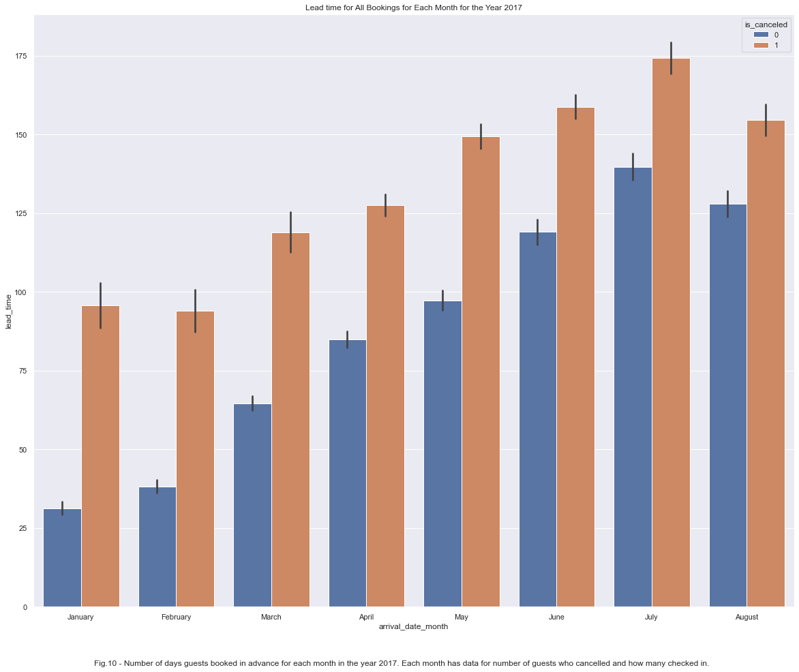


```python
df_tmp.groupby('arrival_date_month')[['is_canceled','lead_time']].mean().sort_values(by='is_canceled', ascending=False)
```


<div>
<style scoped>
    .dataframe tbody tr th:only-of-type {
        vertical-align: middle;
    }

    .dataframe tbody tr th {
        vertical-align: top;
    }

    .dataframe thead th {
        text-align: right;
    }
</style>
<table border="1" class="dataframe">
  <thead>
    <tr style="text-align: right;">
      <th></th>
      <th>is_canceled</th>
      <th>lead_time</th>
    </tr>
    <tr>
      <th>arrival_date_month</th>
      <th></th>
      <th></th>
    </tr>
  </thead>
  <tbody>
    <tr>
      <th>May</th>
      <td>0.437510</td>
      <td>120.224933</td>
    </tr>
    <tr>
      <th>April</th>
      <td>0.434852</td>
      <td>103.667789</td>
    </tr>
    <tr>
      <th>June</th>
      <td>0.431911</td>
      <td>136.141491</td>
    </tr>
    <tr>
      <th>July</th>
      <td>0.373424</td>
      <td>152.974026</td>
    </tr>
    <tr>
      <th>August</th>
      <td>0.368731</td>
      <td>137.798579</td>
    </tr>
    <tr>
      <th>January</th>
      <td>0.341350</td>
      <td>53.410768</td>
    </tr>
    <tr>
      <th>March</th>
      <td>0.337710</td>
      <td>82.825288</td>
    </tr>
    <tr>
      <th>February</th>
      <td>0.327076</td>
      <td>56.514801</td>
    </tr>
  </tbody>
</table>
</div>


```python
first_year = len(df[df['arrival_date_year'] == 2015])
second_year = len(df[df['arrival_date_year'] == 2016])
third_year = len(df[df['arrival_date_year'] == 2017])

print('Number of guests who stayed in either hotel is {}, in the year 2015'.format(first_year))
print('Number of guests who stayed in either hotel is {}, in the year 2016'.format(second_year))
print('Number of guests who stayed in either hotel is {}, in the year 2017'.format(third_year))
```

    Number of guests who stayed in either hotel is 21863, in the year 2015
    Number of guests who stayed in either hotel is 56435, in the year 2016
    Number of guests who stayed in either hotel is 40604, in the year 2017


The data is not equally distributed throughout the years, and we note in the plots above that year 2016 is the only year with data from all 12 months. 


```python
sns.displot(x='lead_time', hue='is_canceled', multiple="stack", kde=True, data=df[df['arrival_date_year'] == 2015], height=10, aspect=16/10);
```


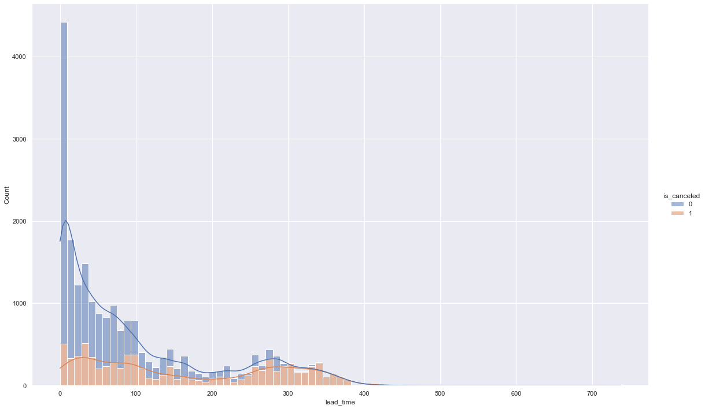


```python
sns.displot(x='lead_time', hue='is_canceled', multiple="stack", kde=True, data=df[df['arrival_date_year'] == 2016], height=10, aspect=16/10);
```


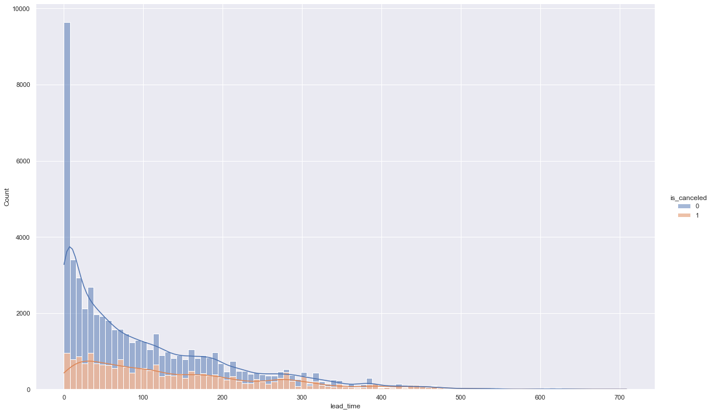


```python
sns.displot(x='lead_time', hue='is_canceled', multiple="stack", kde=True, data=df[df['arrival_date_year'] == 2017], height=10, aspect=16/10);
```


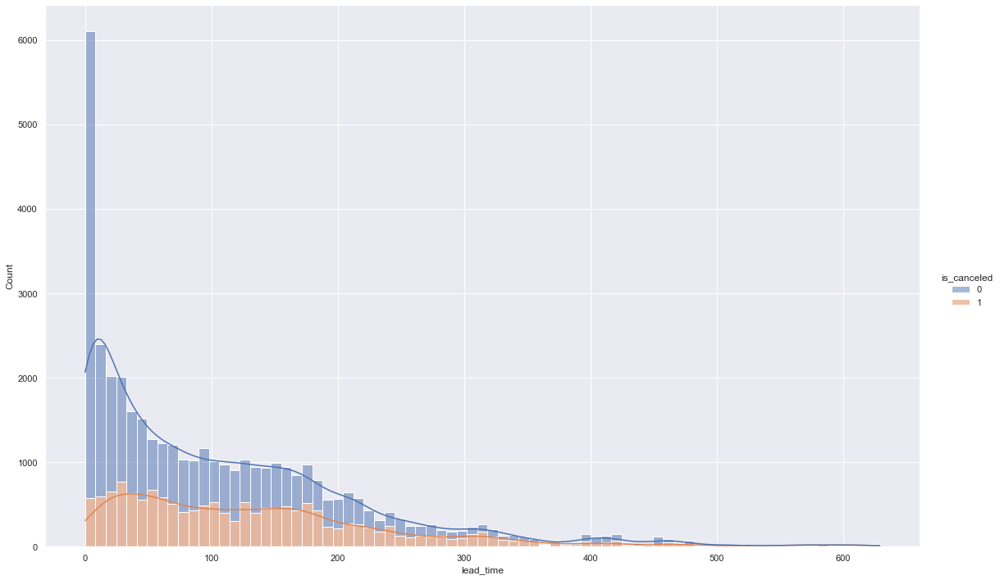


```python
sns.boxplot(x='assigned_room_type',y='adr',data=df);
```


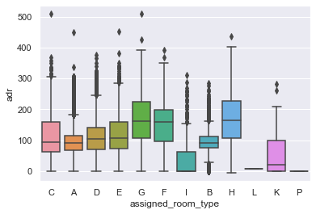


```python
df_adr = df.copy()
```


```python
df_adr['adr_adj'] = df_adr['adr']/(df_adr['adults']+df_adr['children'])
df_adr['adr_adj_wb'] = df_adr['adr']/(df_adr['adults']+df_adr['children']+df_adr['babies'])

df_adr.drop(df_adr[df_adr['adr_adj']>400].index.values,axis=0,inplace=True)
```


```python
sns.boxplot(x='assigned_room_type',y='adr_adj',data=df_adr);
```


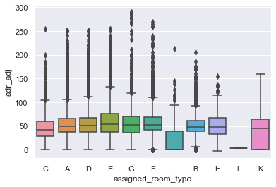


```python
sns.countplot(data=df[~df['company'].isna()], x="is_canceled")
```


    <matplotlib.axes._subplots.AxesSubplot at 0x1413a3880>


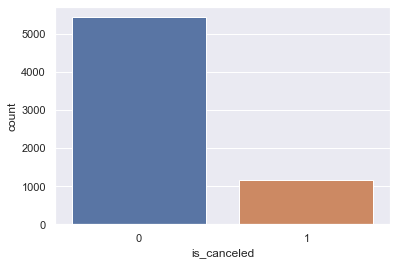


```python
sns.countplot(data=df[df['company'].isna()], x="is_canceled")
```


    <matplotlib.axes._subplots.AxesSubplot at 0x1414696a0>


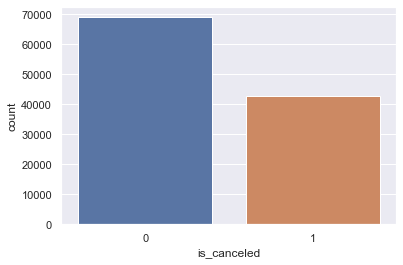


```python
df[~df['company'].isna()].is_canceled.value_counts() #show guests staying on behalf of a company or organization
```


    0    5435
    1    1167
    Name: is_canceled, dtype: int64


```python
x = df[~df['company'].isna()].is_canceled.value_counts()[1]/df[~df['company'].isna()].is_canceled.value_counts()[0]
round(x*100,2)
```


    21.47


We see above that only 21.47% of guests cancel when they register with a company or organization.


```python
df[df['company'].isna()].is_canceled.value_counts() #guests on vacation
```


    0    69016
    1    42890
    Name: is_canceled, dtype: int64


```python
x = df[df['company'].isna()].is_canceled.value_counts()[1]/df[df['company'].isna()].is_canceled.value_counts()[0]
round(x*100,2)
```


    62.15


When a guest is booking to stay for a personal vaction they have a 62.15% of canceling a reservation.

## Dummy Variables


```python
df_columns = ['hotel','arrival_date_month','meal','country','market_segment','distribution_channel',
              'reserved_room_type','assigned_room_type','deposit_type','customer_type']
df_ = df.copy()
df_.drop(['reservation_status','reservation_status_date'],axis=1,inplace=True)
data = pd.get_dummies(df_, prefix=df_columns, columns=df_columns)
```

# Models


```python
X_train, X_test, Y_train, Y_test= train_test_split(data.drop('is_canceled',axis=1), data['is_canceled'], random_state=42, test_size=0.2)
```

## Random Forest Classifier


```python
rf = RandomForestClassifier()
parameter_rf = {
    'n_estimators':[10,50,100,150,200],
    'criterion':('gini','entropy'),
    'max_depth':[None,1,2,3,4,5],
    'min_samples_split':[2,3,4],
    'min_samples_leaf':[1,2,3]
}

clf_rf = GridSearchCV(rf, parameters_rf, cv=5, verbose=10, n_jobs=-1)
clf_rf.fit(X_train, Y_train)
```


```python
rf_tmp = RandomForestClassifier()
#cv_results = cross_validate(rf_tmp, X_train, Y_train, cv=5, verbose=10, n_jobs=-1)
rf_tmp.fit(X_train,Y_train)
```


    RandomForestClassifier()


```python
rf_tmp.score(X_test,Y_test)
```


    0.8906843304362501


```python
feats = {}
for feature, importance in zip(data.drop('is_canceled',axis=1).columns, rf_tmp.feature_importances_):
    feats[feature] = importance

importances = pd.DataFrame.from_dict(feats, orient='index').rename(columns={0: 'importances'}).sort_values(by='importances', ascending=False)
importances.head(10)
```


<div>
<table border="1" class="dataframe">
  <thead>
    <tr style="text-align: right;">
      <th></th>
      <th>importances</th>
    </tr>
  </thead>
  <tbody>
    <tr>
      <th>lead_time</th>
      <td>0.102637</td>
    </tr>
    <tr>
      <th>deposit_type_Non Refund</th>
      <td>0.080077</td>
    </tr>
    <tr>
      <th>adr</th>
      <td>0.071284</td>
    </tr>
    <tr>
      <th>deposit_type_No Deposit</th>
      <td>0.057994</td>
    </tr>
    <tr>
      <th>country_PRT</th>
      <td>0.057188</td>
    </tr>
    <tr>
      <th>arrival_date_day_of_month</th>
      <td>0.053326</td>
    </tr>
    <tr>
      <th>total_of_special_requests</th>
      <td>0.052536</td>
    </tr>
    <tr>
      <th>arrival_date_week_number</th>
      <td>0.046571</td>
    </tr>
    <tr>
      <th>stays_in_week_nights</th>
      <td>0.037800</td>
    </tr>
    <tr>
      <th>previous_cancellations</th>
      <td>0.028475</td>
    </tr>
  </tbody>
</table>
</div>


## Logisitic Regression


```python
lr = LogisticRegression()
"""parameter_lr = {
    'penalty':('l2', 'none'),
    'tol':[1e-5,1e-4,1e-3],
    'C':[0.1,1.0,2.0],
    'solver':('lbfgs','sag','saga'),
    'max_iter':[1000]
}"""
parameter_lr = {
    'penalty':['none'], 
    'tol':[1e-4],
    'C':[1.0],
    'solver':['sag'],
    'max_iter':[1000]
}

clf_lr = GridSearchCV(lr, parameter_lr, cv=5, verbose=10, n_jobs=-1)
clf_lr.fit(X_train, Y_train)
```

    Fitting 5 folds for each of 1 candidates, totalling 5 fits


    [Parallel(n_jobs=-1)]: Using backend LokyBackend with 8 concurrent workers.
    [Parallel(n_jobs=-1)]: Done   2 out of   5 | elapsed:  5.5min remaining:  8.2min
    [Parallel(n_jobs=-1)]: Done   3 out of   5 | elapsed:  5.5min remaining:  3.6min
    [Parallel(n_jobs=-1)]: Done   5 out of   5 | elapsed:  5.5min remaining:    0.0s
    [Parallel(n_jobs=-1)]: Done   5 out of   5 | elapsed:  5.5min finished
    /Users/DavidH/anaconda2/envs/py382/lib/python3.8/site-packages/sklearn/linear_model/_sag.py:329: ConvergenceWarning: The max_iter was reached which means the coef_ did not converge
      warnings.warn("The max_iter was reached which means "


    GridSearchCV(cv=5, estimator=LogisticRegression(), n_jobs=-1,
                 param_grid={'C': [1.0], 'max_iter': [1000], 'penalty': ['none'],
                             'solver': ['sag'], 'tol': [0.0001]},
                 verbose=10)


```python
clf_lr.best_params_
```


    {'C': 1.0, 'max_iter': 1000, 'penalty': 'none', 'solver': 'sag', 'tol': 0.0001}


```python
clf_lr.best_score_
```


    0.804579898626818


```python
clf_lr.best_estimator_.score(X_test,Y_test)
```


    0.8094675554805502


